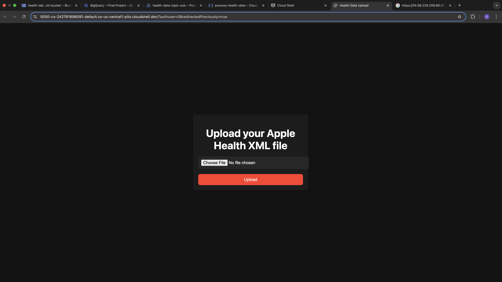
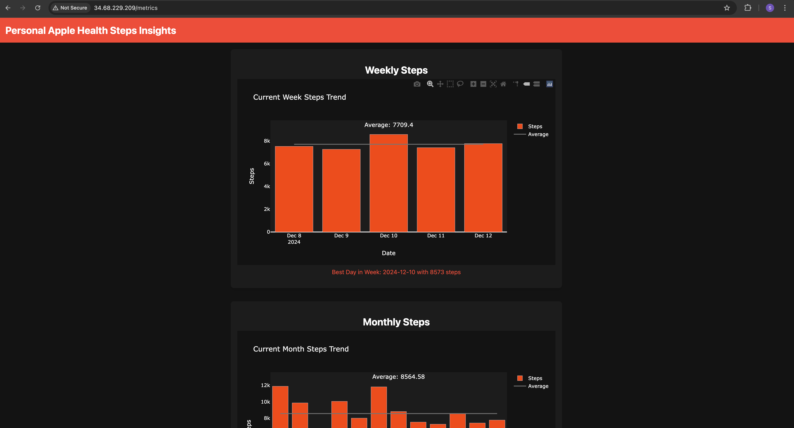
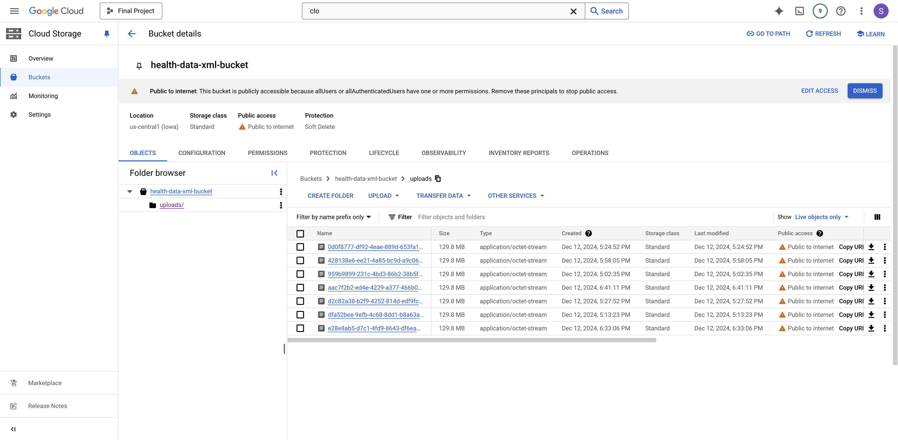
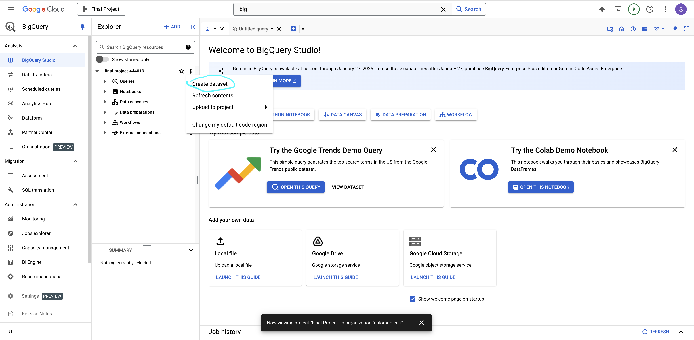
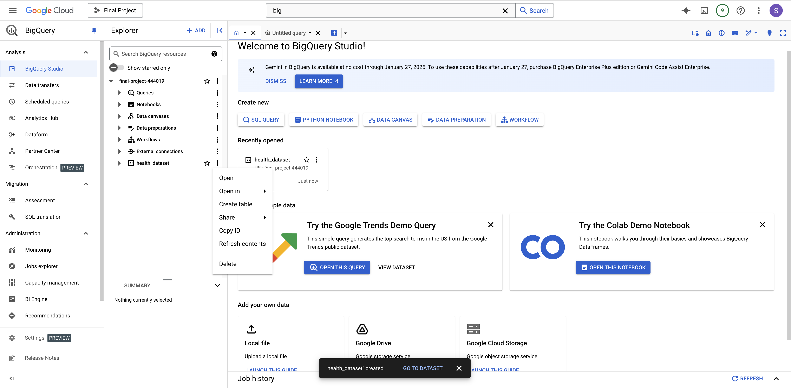
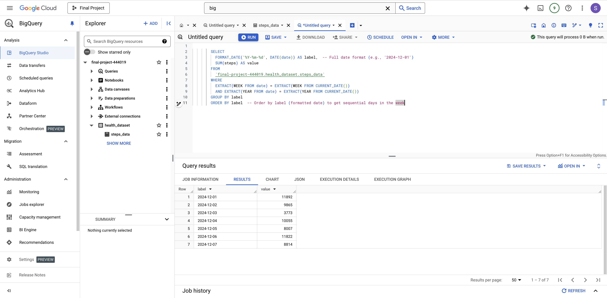
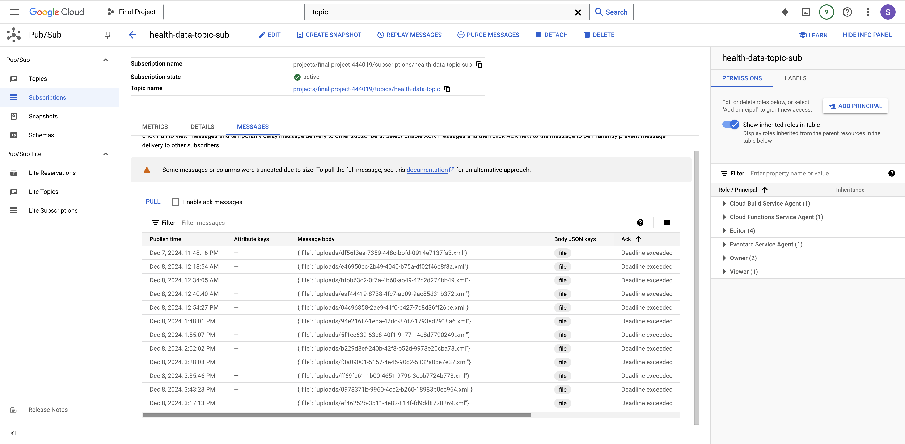
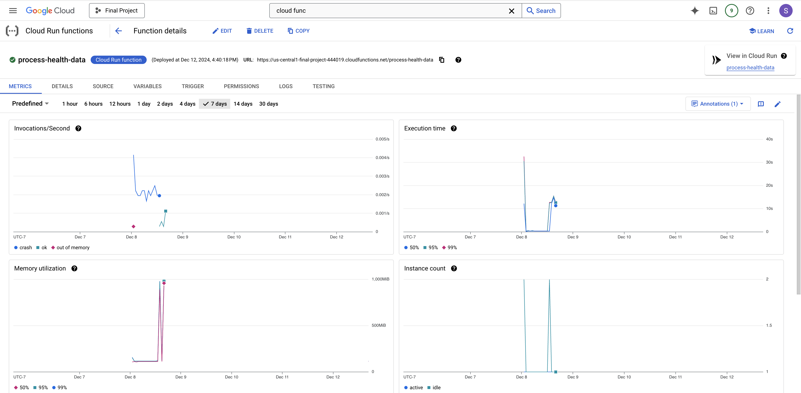

# DCSC Final Project: Team 43

# Participants: Sai Yeshwanth Mekala

# CloudSteps: Deploying a Scalable Health Data Analysis Service on Google Cloud

---

This repository documents the process of setting up and deploying the **CloudSteps** service for analyzing Apple Health data. The service leverages Google Cloud Platform (GCP) for secure, scalable, and efficient processing of Apple Health data. Below are detailed steps and explanations of the setup





---


## Steps for Deployment

### 1. **Set Up GCP Project**
Set the desired GCP project:
```bash
gcloud config set project final-project-444019
```

### 2. **Enable Required GCP Services**
Enable the APIs needed for storage, functions, messaging, and compute services:
```bash
gcloud services enable \
  storage.googleapis.com \
  cloudfunctions.googleapis.com \
  pubsub.googleapis.com \
  bigtable.googleapis.com \
  sqladmin.googleapis.com \
  aiplatform.googleapis.com \
  container.googleapis.com
```

### 3. **Create a Storage Bucket**
Create a Cloud Storage bucket to store XML files:
```bash
gsutil mb -l us-central1 gs://health-data-xml-bucket/
```

Make the bucket publicly readable for demonstration purposes:
```bash
gsutil iam ch allUsers:objectViewer gs://health-data-xml-bucket
```


### 4. **Set Up BigQuery**
Create a BigQuery dataset and table:
1. **Dataset**: `health_dataset`
2. **Table**: `steps_data` with schema:
   - `date`: TIMESTAMP
   - `steps`: INTEGER




### 5. **Create a Pub/Sub Topic**
Create a Pub/Sub topic and subscription for asynchronous communication:
```bash
gcloud pubsub topics create health-data-topic

gcloud pubsub subscriptions create health-data-topic-sub \
    --topic=health-data-topic
```



### 6. **Deploy Cloud Function**
Deploy a Python-based Cloud Function to process the uploaded XML files:
```bash
gcloud functions deploy process-health-data \
  --runtime python310 \
  --trigger-topic health-data-topic \
  --entry-point process_health_data \
  --region us-central1 \
  --source . \
  --memory 8GiB \
  --cpu 4
```


- **Trigger**: Pub/Sub topic `health-data-topic`.
- **Entry Point**: The function `process_health_data` in  Python script.
- **Region**: `us-central1` for low latency.

### 7. **Set Up Docker and Build Flask App**
Encode the private key for secure authentication:
```bash
base64 key > encoded_key.txt
```

Build and push the Flask app as a Docker image:
```bash
docker build -t gcr.io/final-project-444019/my-flask-app:latest .
docker push gcr.io/final-project-444019/my-flask-app:latest
```

### 8. **Create a Kubernetes Cluster**
Create a GKE cluster for hosting the Flask app:
```bash
gcloud container clusters create my-cluster \
    --zone=us-central1-a \
    --num-nodes=3
```

Retrieve the credentials to manage the cluster:
```bash
gcloud container clusters get-credentials my-cluster --zone us-central1-a
```

### 9. **Deploy Flask App to Kubernetes**
Apply Kubernetes configuration files:
```bash
kubectl apply -f secret.yaml
kubectl apply -f deployment.yaml
kubectl apply -f service.yaml
```

Verify the pods are running:
```bash
kubectl get pods
```

### 10. **Access Flask App Locally**
Port forward the service to access it:
```bash
kubectl port-forward my-flask-app-89d9d58b4-jjvb2 5000:5000
```

Access the app by clicking on web preview on port 5000

or

Verify the services are running:
```bash
kubectl get svc
```

Access the service using http://<EXTERNAL-IP>

### 11. **List and Clean Up Resources**
List all running GKE clusters:
```bash
gcloud container clusters list
```

To delete the deployments, services, and secrets:
```bash
kubectl delete -f deployment.yaml
kubectl delete -f service.yaml
kubectl delete -f secret.yaml
```

To delete the GKE cluster:
```bash
gcloud container clusters delete my-cluster --zone us-central1-a
```

---

## Summary of Components

1. **Google Cloud Storage**: Stores uploaded XML files.
2. **Google Pub/Sub**: Manages messaging between Flask and Cloud Functions.
3. **Google Cloud Functions**: Parses XML files and writes structured data to BigQuery.
4. **Google BigQuery**: Stores and queries step data for insights.
5. **Google Kubernetes Engine (GKE)**: Orchestrates the Flask app for scalability.
6. **Docker**: Containerizes the Flask app for portability and deployment.

---


